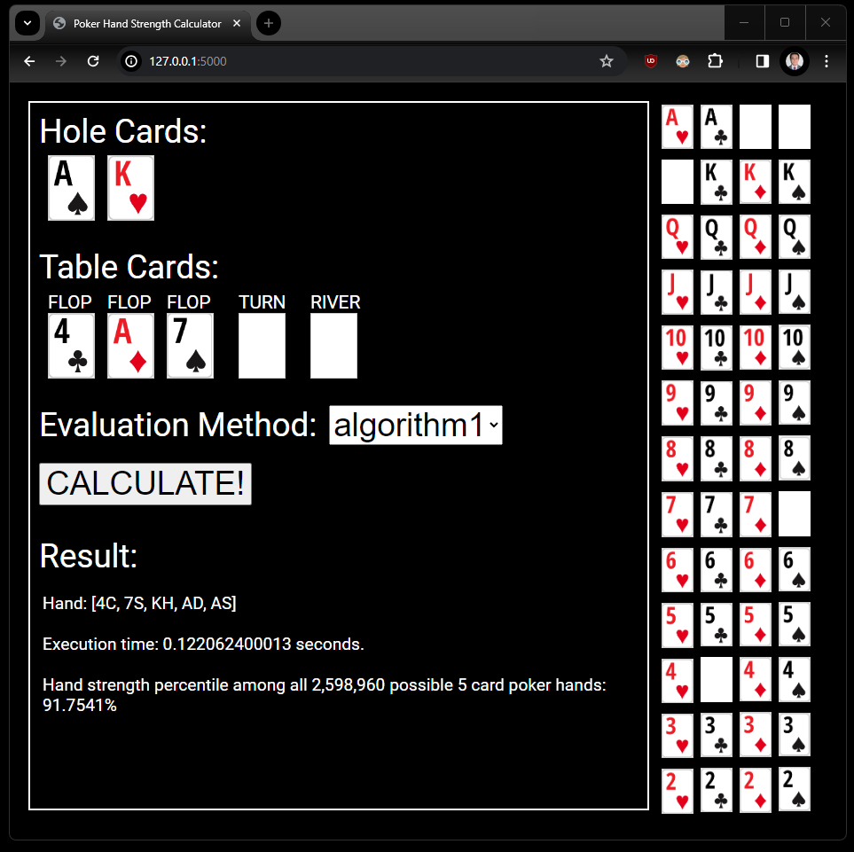

# Poker-Hand-Strength-Visualizer

## Key Assignment Requirements:
Implement 2 non-trivial, **comparable** algorithms or data structures. Data Structures and Algorithms that are **not** counted towards the requirement of two data structures and algorithms:
- Any data structure from Module 2: Lists, Stacks, and Queues,
- Binary Search Tree,
- AVL Tree,
- Binary and Linear Search,
- Selection, Bubble, Heap, and Insertion Sort.

You must use a data set that has at least 100,000 tuples or rows or data points (e.g. 100,000 vertices in a Graph).

