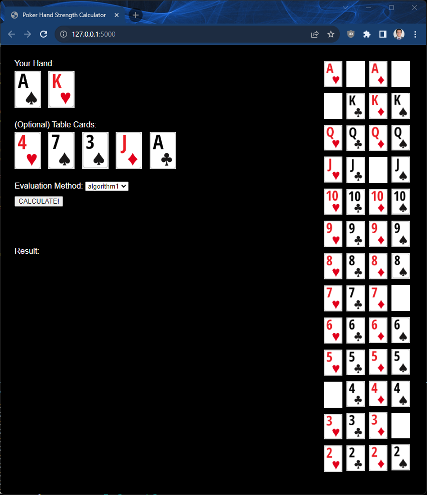

# Poker-Hand-Strength-Visualizer

## Key Assignment Requirements:
Implement 2 non-trivial, **comparable** algorithms or data structures. Data Structures and Algorithms that are **not** counted towards the requirement of two data structures and algorithms:
- Any data structure from Module 2: Lists, Stacks, and Queues,
- Binary Search Tree,
- AVL Tree,
- Binary and Linear Search,
- Selection, Bubble, Heap, and Insertion Sort.

You must use a data set that has at least 100,000 tuples or rows or data points (e.g. 100,000 vertices in a Graph).
 

## UPDATE:
Frontend is fundamentally complete. It takes user input for hand_cards and optional table_cards. Algo1 or Algo2 is called using these parameters to generate output. Created custom 2598960 datapoint dataset of all 5card hands along w their strength to use (Final texa hold'em poker hand is best hand possible using 5 cards among 2 hand cards + 5 table cards). Two functions are fundamentally complete when table cards >= 3.

TO DO: 
- Fix reproducible bug on Royal Flush evaluation (req further bug testing with other types of hands)
- Add evaluation functionality for < 3 table cards. Current algos evaluate full 5 card poker hand using (2 hole cards + 3-5 table cards)
